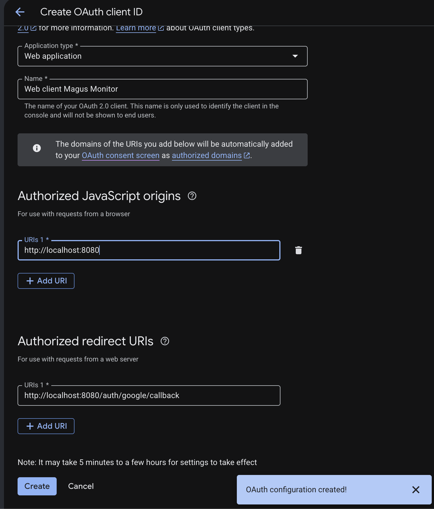

# ALlowing Google Sign In

When creating the Google OAuth client ID, I have to create a google OAuth consent screen.

I choose external audience, and Google generates the clientId and secret for testing mode.

When your app is in Testing mode, Google acts like a gatekeeper to make sure nobody accidentally logs into an unverified app. Here is exactly how to manage your test users and switch to production later.

## Add users for testing mode
If you've already completed the setup, you can find this anytime in your Google Cloud Console sidebar under OAuth consent screen.

Scroll down to the Test users section.

Click the + Add Users button.

Type in the exact @gmail.com (or Google-managed) email addresses of yourself and anyone else helping you test the app.

Click Save.

⚠️ Important: Anyone whose email is not on this list will see a scary "Access Blocked: Project Has Not Been Verified" error screen if they try to log into your web app.

## Phase 2: How to Switch to Production

When your application is fully coded, tested, and ready for the public, you need to lift that testing restriction.

Go back to your Google Cloud Console and click on OAuth consent screen in the left menu.

Look at the top under the Publishing status section.

Click the button that says Publish App.

🔍 Will Google need to verify my app?
Once you click "Publish App," what happens next depends entirely on the "Scopes" (permissions) your app is requesting:

No Verification Needed (Instant): If your web app only asks for basic information—like the user's email address and profile picture—your app goes live instantly the moment you click publish.

Verification Required: If your app requests access to "sensitive" or "restricted" data (like reading their Google Drive files or accessing their Calendar), Google will require you to submit the app for a review before it goes live to everyone.